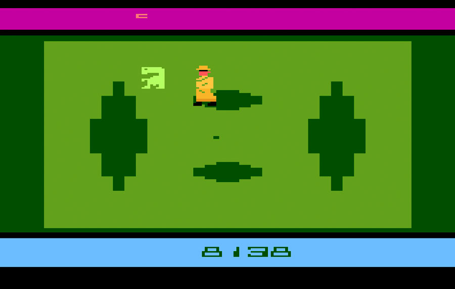
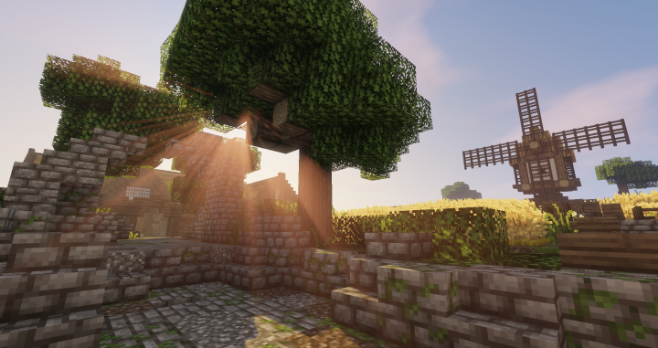

# Gruppe 9
Wir haben uns f�r den Namen **"Gruppe 1"** entschieden.  
Gruppenleiter: Lukas Sauter    
Protokollant: Maximilian Taube

### Spielidee 1 - "What's Inside?"
Die erste Spielidee beschreibt ein Spiel, in dem der Spieler die Aufgabe hat ein Elektroger�t richtig zusammenzubauen.
Dies k�nnte zum Beispiel ein Computer oder ein Fernseher sein und der Spieler hat die Aufgabe die Komponenten richtig zu verkn�pfen
und einzubauen und lernt dabei die entsprechenden Komponenten und deren Funktion genauer kennen. Eine andere M�glichkeit f�r den Aufbau des Spiels
w�re das Ziel ein Netz aus verschiedenen Ger�ten erstellen zu m�ssen - also Ger�te miteinander zu verbinden - wobei nicht
jedes Ger�t nur bestimmte Daten empfangen und senden darf und auf die richtige Verkn�pfung geachtet werden muss. Beide Optionen k�nnten als innerhalb
eines Rasters erfolgen um die Bedienung und Gestaltung zu vereinfachen. Die Thematik des Spiels richtet sich an alle Menschen, die
an Technik und Informatikgrundwissen sowie dem Aufbau allt�glicher Elektroger�te interessiert sind, ist jedoch f�r Kinder unter 8 Jahren
weniger geeignet.


### Spielidee 2 - "Commander"
Die zweite Spielidee beschreibt ein Spiel, in dem der Spieler die Aufgabe hat eine Spielfigur in einem Raster von einem
Anfangspunkt zu einem Zielpunkt zu leiten. Das Spiel besitzt mehrere Level in unterschiedlichen Schwierigkeitsgraden.
Die Steuerung der Spielfigur erfolgt dabei ausschlie�lich �ber das Einf�gen von vordefinierten Pseudo-Codebl�cken.
Das k�nnte z.B. sein: **```if(object_ahead) turn right```** oder **```do{something} while(floorcolor = red)```**. Der
Spieler w�hlt entsprechende Codebl�cke aus einer Levelspezifischen Auswahl aus und ordenet
diese in der richtigen Reihenfolge an um die Spielfigur zum Ziel zu bringen. Eine Kombination verschiedener Codebl�cke
sollte dabei m�glich sein und ein einf�hrendes Tutorial sollte vorhanden sein, dass die Steuerung und das Spielprinzip erkl�rt.
Der Spieler lernt so die verschiedenen Grundgedanken und Prinzipien der Programmierung spielerisch kennen und f�rdert das logische Denken.
Entsprechend ist das Spiel f�r Kinder ab ungef�hr 10 Jahren geeignet.

### Spielanalyse

#### E.T. the Extra-Terrestrial (negativ Bsp.)

[Bild von 8-bitcentral.com](http://www.8-bitcentral.com/reviews/2600et.html)

**Spielstory 1 von 5 Sternen:** Beim Start des Spiels wird man ohne einen Dialog
oder etwas �hnlichem, was die Geschiechte einf�hren w�rde, in das Spielgeschehen
geworfen. Dialoge oder Hinwei�e wie man in dem Spiel Fortschritt erzielt gibt es
einfach nicht. Um zu verstehen was zu tun ist, muss man erst das Handbuch lesen,
in dem dann jedes Spiel Element, wie die Gestalten in Anz�gen die einen
verfolgen, erkl�rt ist. Ein Spiel sollte sich selbst durch das Spielgeschehen
erkl�ren.

**Gestaltung 1 von 5 Sternen:** Die Spielszenen sind in einem detaillosem
Pixelgrafik-stil dargestellt, der oft nur mit Hilfe des Handbuches erkennen
l�sst, was dargestellt werden soll.

**Usability 1 von 5 Sternen:** Die Steuerung wird auch nur mit Hilfe des
Handbuches erkl�rt und ist gradezu unterfordernt schlicht.

- ist ohne das Handbuch nicht spielbar
- Grafik ist unansehnlich und nicht eindeutig
- Story ist flach und unerkl�rt

#### Minecraft (positiv Bsp.)

[Bild von planetminecraft.com](https://www.planetminecraft.com/texture_pack/excalibur)

**Spielstory 5 von 5 Sternen:** Der Spieler startet in einer zufällig generierten, unendlichen Welt.
Er muss sich Lebensmittel erarbeiten und sollte sich auf Nächte vorbereiten, denn da spawnen Monster, die ihm gefährlich werden könnten.
Weiterhin kann er Ressourcen sammeln, mit denen er nahezu alles bauen kann.
Dabei kann er seiner Kreativität freien Lauf lassen, und die Welt nach seinen Vorstellungen frei gestalten.
Zusätzliche Elemente, wie zum Beispiel der "Nether" oder das "Ende" bieten dem Spieler eine zusätzliche Storyline an, die er spielen kann, aber nicht muss.

**Gestaltung 5 von 5 Sternen:** Die generierte Welt besteht aus Blöcken. Zum Vergleich ist der Charakter den mann spielt einen Block breit und zwei Blöcke groß.
Dieses Pixeldesign ist jedoch etwas durchaus einzigartiges und auch schönes.
Weiterhin gibt es auch eine Menge durch die Community geschaffenen "Texture Packs", mit denen man die Textur der Blöcke modifizieren kann.

**Usability 5 von 5 Sternen:** Die Steuerung ist sehr intuitiv. Der Spieler kann sich in alle Richtungen fortbewegen,
 Blöcke mit der linken Maustaste abbauen, und umgekehrt mit der rechten Maustaste platzieren.
